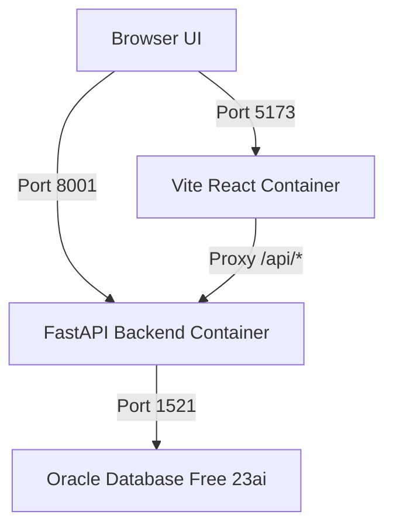

# 67 Mini Mart

**67 Mini Mart** is a production-ready, highly relational, and database-centered full-stack e-commerce storefront and staff management system built for a database design and administration course project. 

The application integrates a customer storefront, a restricted staff operations portal, a FastAPI service layer, and Oracle PL/SQL routines for authentication, transaction management, automated inventory control, and role-based access control (RBAC).

---

## Key High-Fidelity and Modern Features

The application incorporates state-of-the-art e-commerce and database administration patterns:

### 1. Persistent Multi-User Shopping Carts
* Cart states are stored inside local storage partitioned by customer IDs (`sentinel_cart_customer_${customer_id}`).
* Reloading the browser or logging out preserves your basket data, restoring it instantly upon signing back in.

### 2. Automated Guest-to-Customer Cart Merging
* Guest shoppers can browse the catalog and add products to a guest cart.
* Upon signing up or logging in, the guest basket is automatically merged into their customer account cart in local storage and persisted securely.

### 3. Integrated Customer Checkout and Payment Flow
* Provides a secure customer-facing payment API (`POST /api/shop/orders/{order_id}/pay`) that settles order invoices.
* Renders a real-time, interactive "Pay Now" button on the customer order portal next to unpaid items, prompting immediate confirmation and list reloading.

### 4. Cohesive Cashier-Customer Transaction Sync
* When cashiers mark an invoice as paid via the staff portal, the backend triggers a synchronized update that advances the corresponding order status from 'pending' to 'confirmed' automatically.

### 5. Dynamic Inventory Control and Restocking
* **Stock Deductions:** Placing an order immediately decrements the database product stock, reserving items for the buyer.
* **Automatic Stock Recovery:** Cancelling an order (via staff portal) immediately returns all items back to the storage/warehouse, updating inventory automatically.
* **Product Re-activation:** Staff can re-activate discontinued products with a green "Reactivate" option which restores visibility in the shop after restocking.

### 6. Premium Responsive Dark Mode
* Beautiful, glassmorphic styling utilizing Tailwind CSS.
* Capitalized usernames with perfect contrast colors in both light and dark modes to guarantee readability across all headers, cards, and portals.

---

## Technology Stack

| Layer | Technology | Purpose |
| --- | --- | --- |
| **Frontend** | React 18, Vite, Tailwind CSS, React Router 6 | Responsive, beautiful customer UI and staff portal |
| **Backend** | FastAPI, Python 3.12, python-oracledb (Connection Pooling) | HTTP API server, session checking, file processing |
| **Database** | Oracle Database Free 23ai | Relational schemas, PL/SQL routines, logs, constraints |
| **Runtime** | Docker, Docker Compose | Local containerized services and database persistence |

---

## Project Structure

```text
.
├── backend/
│   ├── routers/             # Module API routers (auth, shop, sales, stock, dashboard, etc.)
│   ├── db.py                # Database connection pool setup
│   ├── deps.py              # Middleware authentication and role enforcement
│   ├── schemas.py           # Strict Pydantic models for validation
│   └── manage_staff.py      # Staff user sync utility script
├── data/
│   └── seed.sql             # Demo seed data, roles, users, categories, products
├── docs/
│   ├── demo_accounts.md     # Markdown reference of accounts
│   ├── demo_users.txt       # Plain text reference of accounts
│   └── customer_auth_plan.md# Customer security roadmap
├── frontend/
│   ├── src/
│   │   ├── api/             # Client REST API handlers (Endpoints, Axios client)
│   │   ├── auth/            # Auth contexts (Staff, Customer) and protection guards
│   │   ├── components/      # Reusable UI elements (Navbar, Theme Toggle, etc.)
│   │   └── pages/           # Portal page views (Shop, MyOrders, Products, Dashboard, etc.)
│   └── tailwind.config.js   # Tailored theme color config
├── queries/
│   ├── auth.sql             # Oracle PL/SQL staff auth functions (login, logout, validation)
│   ├── customer_auth.sql    # Oracle PL/SQL customer auth tables and functions
│   ├── permissions.sql      # Permission checking engine and security views
│   ├── test_login.sql       # SQL unit tests for login transactions
│   └── test_permissions.sql # SQL unit tests for RBAC role permissions
├── schema/
│   └── schema.sql           # Database tables, keys, triggers, constraints
└── docker-compose.yml       # Production-mirrored local service orchestrator
```

---

## Architecture and Network Setup

The system deploys 3 isolated Docker services in a shared network bridge:



| Service | Container Role | Host Port | Internal Port |
| --- | --- | --- | --- |
| **`db`** | Oracle database | `1521` | `1521` |
| **`backend`** | FastAPI Web server | `8001` | `8000` |
| **`frontend`** | Vite dev server | `5173` | `5173` |

---

## Database Initialization Flow

When the `db` service container boots for the first time, it executes files inside `/container-entrypoint-initdb.d/` in alphanumeric order:

1. **`schema/schema.sql`**
   Defines relational tables (`roles`, `users`, `sessions`, `categories`, `products`, `product_images`, `customers`, `customer_sessions`, `orders`, `order_items`, `invoices`, `audit_logs`, `system_config`) with strict triggers, foreign keys, and indexes.
2. **`queries/auth.sql`**
   Creates Oracle PL/SQL functions that manage secure staff sessions:
   * `fn_login(username, password_hash, ip)`: Starts a secure transaction, checks MD5 credentials, deactivates prior sessions, and issues a session token.
   * `fn_validate_session(token)`: Validates the token against expiration, updates `last_login`, and returns user role.
   * `fn_logout(token)`: Explicitly closes and deletes a session.
3. **`queries/customer_auth.sql`**
   Creates tables and stored procedures for customer authorization:
   * `fn_customer_signup(email, password, name, phone)`: Validates formatting and creates customer accounts.
   * `fn_customer_login(email, password)`: Issues customer session tokens.
   * `fn_customer_validate_session(token)`: Validates session status and returns customer credentials.
4. **`queries/permissions.sql`**
   Creates security verification functions:
   * `fn_check_permission(token, module)`: Queries the role permissions map dynamically to authorize or deny access.
   * `v_role_permissions`: View mapped roles to permission flags.
   * `v_active_sessions`: Audit view of currently running user sessions.
5. **`data/seed.sql`**
   Seeds initial records into Oracle: categories, suppliers, demo users, product listings, images, orders, invoices, and system configuration.

---

## Running the Application Locally

### Prerequisites
* Docker Desktop with Docker Compose installed.

### Start the Application
Run this command in the project root to build and run all services in the background:
```bash
docker compose up --build -d
```

### Access Ports and URLs
Once the services start, you can access the system at the following endpoints:

| Module | URL |
| --- | --- |
| **Customer Storefront** | [http://localhost:5173/](http://localhost:5173/) |
| **Customer Login** | [http://localhost:5173/login](http://localhost:5173/login) |
| **Customer Signup** | [http://localhost:5173/signup](http://localhost:5173/signup) |
| **Staff Portal** | [http://localhost:5173/staff/login](http://localhost:5173/staff/login) |
| **Interactive API Docs** | [http://localhost:8001/docs](http://localhost:8001/docs) |
| **Backend Health Check** | [http://localhost:8001/health](http://localhost:8001/health) |

### Check Logs and Status
```bash
# View running status
docker compose ps

# Check backend container logs
docker compose logs backend -f
```

### Stop and Reset Services
```bash
# Stop containers without erasing database data
docker compose down

# Wipe and completely rebuild the database and application from scratch
docker compose down -v
docker compose up --build -d
```

---

## Demo User Accounts

The database seeds predictable accounts to make local demonstrations and testing extremely convenient:

### Customers
Seeded customer profiles (e.g. `Sophea Chan`, `Dara Nguyen`) are seeded as database customer records to display invoices/orders. 
To log in as a customer:
1. Navigate to `/signup` and create a fresh test account.
2. Sign in from `/login` using your registered credentials.
3. You will immediately be able to add items to your cart, place orders, click "Pay Now", and review order statuses.

### Staff Portal Accounts
The staff portal has one-click login buttons for these seeded roles:

| Role | Username | Password | Access Level |
| --- | --- | --- | --- |
| **Admin** | `admin_user` | `Admin@1234` | Full root access to all modules, config, users, and audit logs |
| **Sales** | `sales_mgr` | `Sales@1234` | Complete order placement, stock management, and invoicing |
| **Cashier** | `cashier_01` | `Cash@1234` | Processes orders, marks invoices as paid, and view operations |
| **User** | `user_01` | `User@1234` | Read-only view access across products and orders (no writes) |

*Negative Test Account:* `inactive_usr` (Password: `Old@1234`, Role: `User`, Status: `Disabled`) is seeded to prove that deactivated staff accounts are blocked from accessing the system.

---

## Role-Based Access Control Map

| Stored Procedure Check | Admin Role | Sales Role | Cashier Role | User Role |
| --- | --- | --- | --- | --- |
| **Admin module** (`can_admin`) | **Yes** | No | No | No |
| **Sales module** (`can_sales`) | **Yes** | **Yes** | **Yes** | No |
| **Stock module** (`can_stock`) | **Yes** | **Yes** | No | No |
| **View module** (`can_view`) | **Yes** | **Yes** | **Yes** | **Yes** |

---

## CLI Staff Account Manager

Manage staff status and credentials directly from the host terminal:

```bash
# List all registered staff accounts
docker compose exec backend python manage_staff.py --list

# Sync the staff list inside manage_staff.py with Oracle
docker compose exec backend python manage_staff.py

# Deactivate (disable) an account
docker compose exec backend python manage_staff.py --deactivate user_01

# Reactivate (enable) an account
docker compose exec backend python manage_staff.py --activate user_01
```

---

## Verification and Test Suite

Validate that all backend controllers and database procedures operate perfectly:

```bash
# Run Oracle PL/SQL stored transaction tests
docker compose exec -T db sqlplus -s sentineldb/sentinelpass@//localhost/FREEPDB1 @/queries/test_login.sql

# Run Oracle PL/SQL stored RBAC permission tests
docker compose exec -T db sqlplus -s sentineldb/sentinelpass@//localhost/FREEPDB1 @/queries/test_permissions.sql

# Run the complete end-to-end API Smoke Test Suite (checks 25 critical paths)
node scripts/smoke_api.mjs
```

---

## License
Private and Confidential. Course Project of the Department of Applied Mathematics and Statistics at ITC, Phnom Penh, Cambodia. Built by Menghong Heng.
