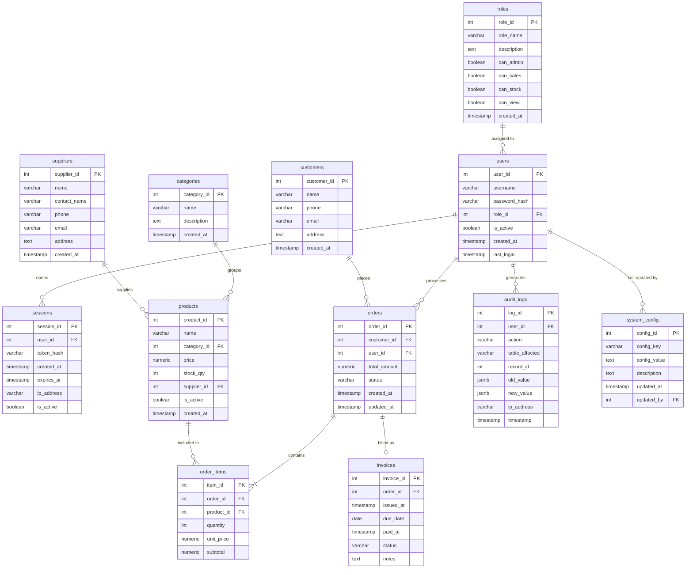

# SentinelDB — ER Diagram

---

## Foreign Key Summary

| Table | Column | References |
|---|---|---|
| `users` | `role_id` | `roles.role_id` |
| `sessions` | `user_id` | `users.user_id` |
| `products` | `category_id` | `categories.category_id` |
| `products` | `supplier_id` | `suppliers.supplier_id` |
| `orders` | `customer_id` | `customers.customer_id` |
| `orders` | `user_id` | `users.user_id` |
| `order_items` | `order_id` | `orders.order_id` |
| `order_items` | `product_id` | `products.product_id` |
| `invoices` | `order_id` | `orders.order_id` |
| `audit_logs` | `user_id` | `users.user_id` |
| `system_config` | `updated_by` | `users.user_id` |

---

## Cardinality Notes

| Relationship | Type | Meaning |
|---|---|---|
| roles → users | 1 : N | One role is held by many users |
| users → sessions | 1 : N | One user can have many active sessions |
| users → orders | 1 : N | One cashier/staff processes many orders |
| categories → products | 1 : N | One category groups many products |
| suppliers → products | 1 : N | One supplier provides many products |
| customers → orders | 1 : N | One customer places many orders |
| orders → order_items | 1 : N (mandatory) | Every order has at least one item |
| products → order_items | 1 : N | One product appears in many order lines |
| orders → invoices | 1 : 0..1 | An order generates at most one invoice |
